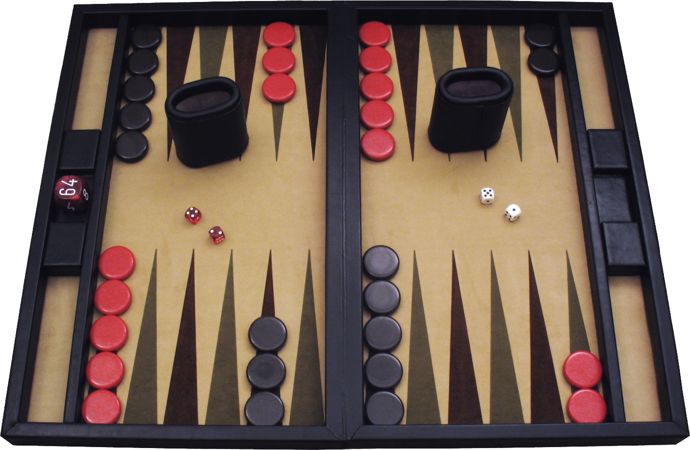

# Backgammon

[Backgammon](https://en.wikipedia.org/wiki/Backgammon) je igra na igralni deski za dva igralca. 
Vsak igralec ima petnajst figur in jih premika po štiriindvajsetih trikotnikih glede na met dveh igralnih kock. 
Cilje igre je spraviti vseh petnajst figur čim prej z igralne površine, nekako tako kot pri igri človek ne jezi se. 
Igra je hitra in dinamična, zahteva pa tudi nekaj znanja.

<b>Začetna razporeditev:</b> (za vsakega igralca) 
- 2 na 24. točki
- 5 na 13. točki
- 3 na 8. točki
- 5 na 6. točki

## Dinamika
- 2 igralca
- Začetno stanje (slika)
- Začetni met (vsak igralec vrže 1 kocko) - zmagovalec upošteva vrednost obeh kock za začetek igre
- Ob izenačenju začetnega meta se vrednost igre podvoji in met se ponovi
- Pomikanje figur do hiše nato z deske(igre)
- Svetle figure se pomikajo v smeri urinega kazalca
- Temne figure se pomikajo v obratni smeri urinega kazalca
- Poteze lahko povrnemo, dokler kock ne vrnemo v posodo za mešanje
- Kocka podvajanja (začetna pozicija 64 = x1)
- Zmagovalec dobi (1 * faktor podvajanja) točk
- Zmagovalec dobi 2 točki, če nasprotnik ni uspel odstraniti nobene figure in faktor podvajanja enak 1

## Mehanika
- Začetek (slika)
- Konec (igralec uspe spraviti vse svoje figure v svojo hišo in nato iz nje)
- Met kock
- Če igralec vrže dve enaki števili se mu met podvoji (3+3=6 => (3+3)*2=12)
- Pomik figur glede na vrednost meta (vrednost meta lahko razdelimo -> 8 | 5 + 3)
- Figure na polju lahko premikamo, če na pregradi nimamo figur
- Če figur s pregrade ne moremo premakniti, moramo predati potezo
- Figura s pregrade nadaljuje pot na 24. polju
- Če je na polju 1 (nasprotnikova) figura, jo lahko zbijemo (figura se prestavi na pregrado)
- Če sta na polju vsaj 2 (nasprotnikovi) figuri, se na to polje ne moremo premakniti
- Če igralec zavrne podvojitev nasprotniku prišteje 1 točko
- Igralec, ki podvoji vrednost igre, postane lastnik podvojitvene kocke
- Igralec lahko poveča podvojitev, če je pred tem ni podvojil nihče ali če je lastnik (podvojitvene) kocke

## Elementi
- 2 hiši (hiša vsakega igralca, je na njegovi desni v spodnjem kvadrantu)
- 4 kocke (vsak igralec ima 2)
- 15 belih figur
- 15 črnih figur
- 4 kvadranti
- 24 (4 kvadranti * 6 polj) polj oz. trikotnikov (<i>points</i>)
- pregrada (<i>barrier / bar<i/>)